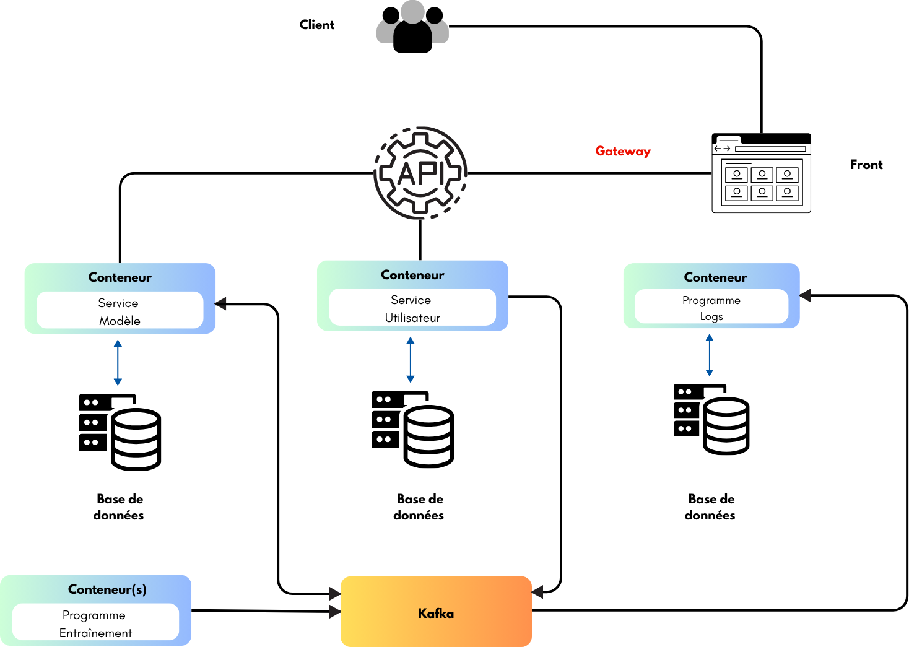
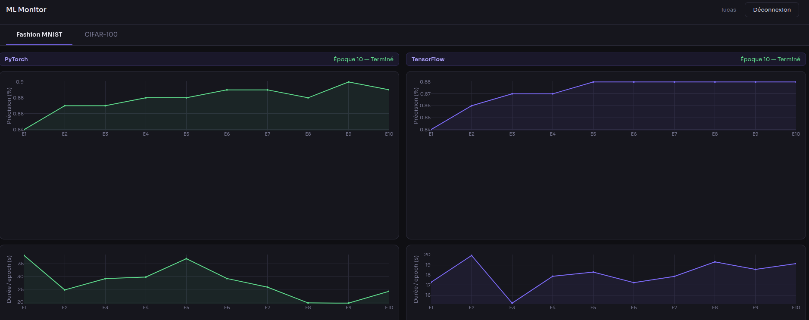

# ML Monitor

Application de monitoring en temps réel des performances de modèles de deep learning, inspirée du benchmark GAIA.

## Lancement

```bash
docker compose up -d --build
```

L'application est accessible sur `http://localhost:5000`.

## Stack technique

- **Frontend** : HTML / CSS / JS (FastAPI static)
- **API Gateway** : Python FastAPI
- **Message broker** : Apache Kafka
- **Entraînement** : PyTorch et TensorFlow (Fashion MNIST, CIFAR-100)
- **Base de données** : PostgreSQL (3 instances : utilisateurs, modèles, logs)
- **Orchestration** : Docker Compose

## Fonctionnalités

- Authentification et gestion des comptes
- Monitoring en temps réel des entraînements (précision, vitesse, CPU, RAM)
- Comparaison côte à côte de PyTorch et TensorFlow
- Accès restreint aux métriques système pour les administrateurs

## Comptes préexistants

| Utilisateur | Mot de passe | Rôle  |
|-------------|--------------|-------|
| marc        | admin        | Admin |
| sonny       | admin        | Admin |
| thomas      | user         | User  |
| camille     | user         | User  |
| lucas       | user         | User  |

## Architecture




## Exemple de visualisation



## Contact

- Marc DJOLE — djolemarc@cy-tech.fr
- Sonny BERTHELOT — berthelots@cy-tech.fr